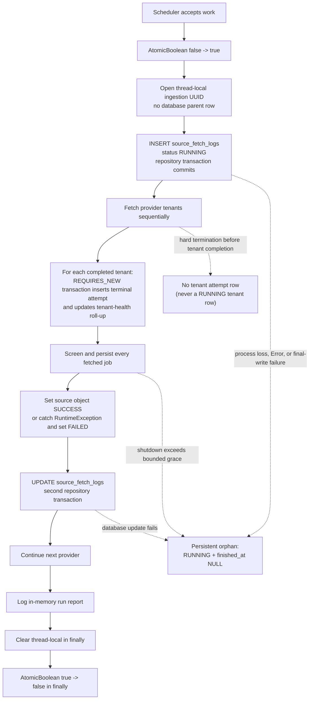

# Phase 4B.4A: orphaned source run diagnosis

## Decision

**Recommended decision: FIX.** The seven rows are inert historical observability artifacts, so there is no production availability emergency and no automatic cleanup is justified. However, the current lifecycle can still produce another orphan if the JVM stops, an `Error` unwinds the source call, or the terminal database update fails after the initial `RUNNING` insert committed.

The smallest safe response has two independently approved parts:

1. harden source-log finalization and graceful-interruption handling in code; and
2. if clean historical reporting is desired, run an explicit, default-off, fingerprint-guarded one-shot reconciliation after a read-only preview.

No Flyway migration is required for the historical cleanup. The seven rows must remain untouched until a write phase is separately approved.

## Scope and evidence snapshot

This diagnosis was read-only with respect to production data and runtime state. No ingestion was triggered, no container was restarted, no environment file or migration was edited, and no historical row was changed.

The inventory was captured on schema V12 at approximately **2026-08-04 21:32:43 UTC** (**2026-08-05 00:32:43 Europe/Bucharest**). At that snapshot:

- `main` and `origin/main` both pointed to `d0c7e7832725d4bef9ab83ec1e884eca8eeadfc5`;
- the app and PostgreSQL containers were healthy;
- the app container had started at `2026-08-04 21:23:09.340753592 UTC`, after every orphan;
- PostgreSQL had started at `2026-08-02 19:13:50.347723713 UTC` and had not restarted;
- the live `/health` response was `UP`, with database and schema `READY`;
- no database session other than the diagnostic query was non-idle; and
- current-container logs from startup through the snapshot contained no ingestion activity.

The database catalog contains **no `ingestion_runs` table** and no other persisted ingestion-parent record. `IngestionRunContext` is a thread-local Java object whose UUID is copied into child rows; it has no `started_at`, `finished_at`, `status`, owner token, heartbeat, or terminal update in PostgreSQL.

## Exact production inventory

All timestamps below are UTC. `source_fetch_logs` has no `updated_at` column, so “updated” is structurally unavailable. Every listed `finished_at` is SQL `NULL`.

| Source log PK | Ingestion run ID | Provider/source | Tenant | `started_at` | `finished_at` / updated | Age at snapshot | Persisted parent state | Persisted child state |
|---:|---|---|---|---|---|---|---|---|
| 69 | `NULL` | ashby | Not stored on aggregate row | 2026-08-02 21:23:00.018360 | `NULL` / no column | 2d 00:09:43.615 | No parent row; pre-V10 correlation unavailable | No tenant-attempt model existed for this row |
| 74 | `NULL` | ashby | Not stored on aggregate row | 2026-08-02 22:44:00.005950 | `NULL` / no column | 1d 22:48:43.627 | No parent row; pre-V10 correlation unavailable | No tenant-attempt model existed for this row |
| 79 | `NULL` | ashby | Not stored on aggregate row | 2026-08-02 23:16:00.013109 | `NULL` / no column | 1d 22:16:43.620 | No parent row; pre-V10 correlation unavailable | No tenant-attempt model existed for this row |
| 92 | `34746e50-f4a5-4c77-9a94-a635a1b493cf` | ashby | Aggregate across 22 tenants | 2026-08-03 11:17:00.015561 | `NULL` / no column | 1d 10:15:43.618 | No parent row; logical run stopped at its first provider | 22 terminal attempts: 20 `SUCCESS`, 2 `FAILURE`; last finished 11:17:05.569714 |
| 95 | `eeabcbf3-374c-4d55-9e5f-7197db468ace` | recruitee | Aggregate across 7 tenants | 2026-08-03 12:23:32.204421 | `NULL` / no column | 1d 09:09:11.429 | No parent row; two earlier provider siblings are terminal | 7 terminal attempts, all `SUCCESS`; last finished 12:23:44.067662 |
| 96 | `62c315f7-d553-4050-889f-5fb5357465d5` | ashby | Aggregate across 22 tenants | 2026-08-03 12:53:00.009728 | `NULL` / no column | 1d 08:39:43.624 | No parent row; logical run stopped at its first provider | 22 terminal attempts, all `SUCCESS`; last finished 12:53:07.108525 |
| 100 | `88482391-3535-4409-85b7-d1c3ae7dd027` | greenhouse | Aggregate across 10 tenants | 2026-08-03 13:12:27.991412 | `NULL` / no column | 1d 08:20:15.642 | No parent row; three earlier provider siblings are terminal | 10 terminal attempts, all `SUCCESS`; last finished 13:12:39.083343 |

Every orphan has `status='RUNNING'`, `fetched_count=0`, `saved_count=0`, and `error_summary=NULL`.

### Run and child detail

The rows belong to **seven separate logical executions**, not one run:

- Four distinct non-null UUIDs prove four separate runs.
- Rows 69, 74, and 79 predate V10 and cannot be correlated by UUID. They are nevertheless separate logical runs because each is an Ashby provider start, and one `fetchAllSources()` invocation visits the single Ashby bean only once. Complete intervening executions also separate them.

The exact provider siblings for the four UUID-backed runs are:

| Run ID | Provider source-log states |
|---|---|
| `34746e50-f4a5-4c77-9a94-a635a1b493cf` | `92:ashby=RUNNING` |
| `eeabcbf3-374c-4d55-9e5f-7197db468ace` | `93:ashby=SUCCESS` (finished 12:20:58.787157, fetched 1361, saved 2); `94:lever=SUCCESS` (finished 12:23:32.188597, fetched 638, saved 0); `95:recruitee=RUNNING` |
| `62c315f7-d553-4050-889f-5fb5357465d5` | `96:ashby=RUNNING` |
| `88482391-3535-4409-85b7-d1c3ae7dd027` | `97:ashby=SUCCESS` (finished 13:05:33.375375, fetched 1360, saved 0); `98:lever=SUCCESS` (finished 13:07:52.963219, fetched 638, saved 0); `99:recruitee=SUCCESS` (finished 13:12:27.975157, fetched 950, saved 1); `100:greenhouse=RUNNING` |

The exact tenant children of each stuck provider are:

- Source log 92: tenant attempt PKs 92–107 and 110–113 are `SUCCESS` for `Ashby`, `langchain`, `n8n`, `enode`, `linear`, `supabase`, `posthog`, `gitbook`, `deepgram`, `temporal`, `clickhouse`, `airbyte`, `render`, `incident`, `cursor`, `notion`, `qonto`, `attio`, `pleo`, and `runway`; PK 108 (`cohere`) and PK 109 (`elevenlabs`) are `FAILURE`/`RESPONSE_PARSE_ERROR` under the then-current limit.
- Source log 95: tenant attempt PKs 142–148 are `SUCCESS` for `transperfect`, `tether`, `auditdata`, `moneyhash`, `veocareers`, `aidigital`, and `almavivadebelgique`.
- Source log 96: tenant attempt PKs 149–170 are `SUCCESS` for `Ashby`, `langchain`, `n8n`, `enode`, `linear`, `supabase`, `posthog`, `gitbook`, `deepgram`, `temporal`, `clickhouse`, `airbyte`, `render`, `incident`, `cursor`, `notion`, `cohere`, `elevenlabs`, `qonto`, `attio`, `pleo`, and `runway`.
- Source log 100: tenant attempt PKs 206–215 are `SUCCESS` for `gitlab`, `grafanalabs`, `elastic`, `cloudflare`, `datadog`, `canonical`, `twilio`, `yesenergy`, `thepacgroup`, and `algolia`.

There are no `RUNNING` tenant rows. V12 enforces `finished_at NOT NULL` and permits only `SUCCESS`, `EMPTY_SUCCESS`, or `FAILURE` in `source_tenant_fetch_logs`. Production contains 792 `SUCCESS`, 46 `FAILURE`, and zero `EMPTY_SUCCESS` attempt rows at the snapshot.

### Related execution/status inventory

| Relation | Result for active-like state | Interpretation |
|---|---:|---|
| `ingestion_runs` | Table absent | The logical parent cannot be queried or required to have a persisted terminal state. |
| `source_fetch_logs` | 7 `RUNNING`; 152 `SUCCESS`; 0 `FAILED` | The only persisted `RUNNING` operations. |
| `source_tenant_fetch_logs` | 0 `RUNNING` | Terminal-only immutable history by schema. |
| `source_tenant_health` | No `RUNNING` state in its domain | Current terminal roll-up, not an execution lease. |
| `job_analyses` | 0 rows | No active analysis execution. |
| `llm_budget_reservations` | 0 rows | No active reservation. |
| `llm_usage_events` | 0 rows | No active usage event. |
| `resume_versions` / `cover_notes` | 0 rows | No `IN_PROGRESS` document generation. |

There were no genuinely active `RUNNING` source rows at the snapshot. Each orphan predates the current JVM by more than a day, each provider has many later successful rows (12 to 19 later successes), the newest related provider success finished by `2026-08-04 21:22:37.346744 UTC`, and the current JVM had emitted no ingestion activity.

## Timeline correlation

### Confirmed

- Rows 69, 74, and 79 were created before V10 installed at `2026-08-03 10:51:38.482626 UTC`, which exactly explains their null run IDs and lack of tenant children.
- V10 was installed at 10:51:38 UTC and the next recorded provider run began at 10:53:00 UTC. V11 was installed at 12:08:59 UTC between orphan 92 and the next run at 12:11:00 UTC. Flyway installation occurs during application startup, so these timestamps prove application start/deployment boundaries near this group of controlled executions.
- Every orphan start was off the normal `0 0 */6 * * *` Europe/Bucharest boundaries: 00:23, 01:44, 02:16, 14:17, 15:23, 15:53, and 16:12 local time. They were not normal six-hour cron starts.
- Each UUID-backed orphan's tenant network work completed seconds after the aggregate source row began, but the aggregate row was still `RUNNING`. The long remaining section is per-job screening and persistence.
- A later successful run of the same provider exists after every orphan. The first later starts were 22 minutes to 6 hours 25 minutes later, except source log 96, whose replacement run began only 3 minutes later.
- The same-JVM `AtomicBoolean` would have rejected a second scheduled ingestion while source log 96's invocation was still alive. The 3-minute replacement therefore requires a different JVM/process, a prior process ending, or an invocation path outside that guard.
- Only the current app container is retained. It was created on 2026-08-04 at 21:23 UTC, so historical container exit signals and shutdown logs for August 2–3 are no longer available from Docker.

### Inferred, not proven

The direct cause of each row was process loss or interruption after the initial insert and before the terminal update. The evidence is strongest for controlled deployment/test runs: off-cron start times, Flyway-backed application start boundaries, later replacement executions, and the 3-minute cross-process replacement after source log 96. Row 79 also began 11 minutes before the related screening commit at 02:27 local time, consistent with a controlled pre-commit validation run.

The retained evidence cannot distinguish a graceful Compose recreation that exhausted its grace period from an explicit process interruption, SIGKILL, JVM failure, or final database-write failure for each individual row. No historical container log or parent completion record remains, so assigning a specific signal to a specific PK would be speculation.

## Lifecycle



### Ingestion run

- Creation: `IngestionRunContext.open()` creates a random UUID in memory before the provider loop. There is no transaction or row.
- Success/failure: there is no persisted run status. A report is built and logged only if the loop returns normally.
- Exception handling: the run has only `finally { IngestionRunContext.clear(); }`; it does not reconcile database children.
- Termination: a hard process exit discards the thread-local state. Nothing at the next startup knows that the UUID was previously owned.

### Provider source fetch log

- Creation transaction: `logs.save(new SourceFetchLog(...))` initializes `RUNNING` and commits through the Spring Data repository before external fetch or screening. `JobIngestionService` itself is not transactional.
- Success transition: only after `source.fetchJobs()` and the complete raw-job processing loop, `succeed()` sets `SUCCESS`, counts, and `finished_at`.
- Failure transition: an outer `catch (RuntimeException)` calls `fail()`, which sets `FAILED`, `finished_at`, and a UTF-16-safe 500-character summary.
- Per-job exceptions: each `RuntimeException` is caught and logged; it does not abort or orphan the provider row.
- Final persistence: `logs.save(log)` occurs after the catch, not in a `finally`, in a second independent repository transaction.
- There is no retry, compare-and-set terminal update, startup reconciliation, maintenance reconciliation, heartbeat, owner token, or repository query for `RUNNING` rows.

### Tenant fetch log and health roll-up

- No `RUNNING` tenant row is created. Timing begins in memory, the external call returns or throws, and only then is a terminal `SourceTenantFetchLog` constructed.
- `SourceTenantHealthRecorder.record()` uses `REQUIRES_NEW` to insert the immutable attempt and update the provider/tenant roll-up atomically.
- Runtime fetch failures are classified and converted to terminal `FAILURE`; observability persistence failures are logged and swallowed so ingestion continues.
- Abrupt process termination during a tenant call produces missing attempt telemetry, not an orphan tenant row. A transaction failure rolls back both the attempt and roll-up update.

### Shutdown and process termination

- `ApplicationLifecycleGate` changes only an in-memory `acceptingWork` flag on `ContextClosedEvent`, preventing new scheduled work.
- The scheduler has a 20-second bounded shutdown phase and Compose has a 30-second app stop grace period. Existing ingestion work has no cooperative lifecycle check inside the raw-job loop and no source-log shutdown callback.
- If an active run finishes within the grace period, the normal terminal update executes. If it does not, later process termination can leave the already committed `RUNNING` row.
- Java `finally` blocks are not guaranteed on SIGKILL, JVM crash, host loss, or power loss. The current provider terminal update is not in a `finally` even for catchable unwinding.

## Every current orphan-producing path

1. **Hard process loss after the initial insert:** SIGKILL, OOM kill, JVM crash/halt, host loss, or container replacement after grace expires.
2. **Graceful shutdown that becomes forced termination:** the lifecycle gate blocks only new runs; a long screening loop can outlive the 20/30-second windows.
3. **Any `Error` after the insert:** the code catches `RuntimeException`, not `Error`, and the final save is not in `finally`.
4. **Terminal database-write failure:** if the second `logs.save(log)` fails, the first committed row remains `RUNNING`; the exception escapes the run and there is no retry/reconciliation.
5. **Failure while constructing the terminal state:** for example, an exceptional clock or resource failure while handling another exception can bypass the final save. This is low-probability but structurally possible.

Normal provider `RuntimeException`s and normal per-job `RuntimeException`s do not create an orphan when PostgreSQL remains available: the former becomes `FAILED`, and the latter is isolated before the source becomes `SUCCESS`.

The current code can therefore still create new orphans. Commit `d0c7e78` changed scheduler wiring and Telegram polling only; it did not change `JobIngestionService`, `SourceFetchLog`, transaction boundaries, shutdown finalization, or database ownership. The dedicated Telegram scheduler does not create, clean, or protect these rows. It keeps polling responsive and leaves ingestion concurrency at one application-scheduler thread, so the orphan paths are unchanged.

## Operational impact

### Overlap protection

Overlap prevention does **not** query PostgreSQL. `JobSchedulingService` uses only a private, per-JVM `AtomicBoolean fetchRunning`. It resets in a scheduler `finally` when the method unwinds and resets inherently when the JVM is replaced. Consequently:

- the seven stale rows do not block ingestion startup or any future scheduled run;
- source log 96 and the run beginning three minutes later are compatible with different JVM generations because the guard is not distributed; and
- multiple application replicas would not protect one another.

### Health, monitoring, counts, and reports

- `/health` checks database reachability, Flyway validation, and artifact storage. It never reads source fetch logs. It was `UP` during the snapshot.
- `/api/sources/health` reads only `source_tenant_health`. It does not read `source_fetch_logs` or tenant-attempt history. The live endpoint's unhealthy tenants were caused by their own latest terminal attempt states, not by these seven rows.
- `/internal/v1/operations/metrics` reports application, analysis, document, and in-memory operational counters. It has no source-run counter.
- The codebase contains no alert, dashboard query, failure-count query, or reporting query against `source_fetch_logs`. The repository exposes only inherited write/CRUD methods and is used only by ingestion.
- A later ingestion report is assembled in memory from that run only; stale rows are never loaded into it. An interrupted run has no final report log.
- Current application failure counts are not increased: the rows are `RUNNING`, not `FAILED`. An external/ad-hoc query that treats `RUNNING` as active or includes it in denominators could be misleading, but no such consumer exists in this repository.

A logically completed `fetchAllSources()` cannot normally contain a `RUNNING` provider child: the terminal repository save must return before the source method and provider loop continue. If that save throws, the parent invocation does not return successfully. Production confirms that every stuck provider is the last provider recorded for its UUID. A provider row can, and here does, contain terminal tenant children while it remains `RUNNING`, because source status is delayed until all fetched jobs finish screening.

The operational risk today is therefore **low**. The material risks are inaccurate audit history, misleading ad-hoc “currently running” queries, and recurrence during a future deployment or hard interruption.

## Safe reconciliation policy

### Orphan definition

A row is eligible only when all of the following hold; age alone is never sufficient:

1. `source_fetch_logs.status='RUNNING'` and `finished_at IS NULL`.
2. It is at least **6 hours old** (one complete normal cron interval and more than three times the observed 1h45m maximum successful provider duration). This is a candidate filter, not proof.
3. Its entire preview fingerprint is unchanged at write time.
4. All persisted tenant children are terminal, and no persisted sibling has an active-like state. Pre-V10 rows must be explicitly identified as legacy rather than silently treated as having no children.
5. The owning process is proven gone: the row predates the current app-container start, only the expected app instance exists, no current ingestion is active, and a later terminal run of the same provider exists. Every one of the seven rows satisfies the historical form of this proof.
6. The parent ingestion is terminal or its owner is conclusively dead. **Current V12 cannot satisfy a database-only terminal-parent check because no parent row exists.** Generic automatic cleanup must therefore fail closed. A future durable parent/owner lease would require a migration; it is not justified for this one historical cleanup.

### One-shot preview/write design

Use an explicit command, not startup, maintenance, or pre-ingestion mutation:

- Default mode `OFF`; separate `PREVIEW` and `WRITE` modes; an independent write-capability flag defaults false.
- Preview is read-only and emits the ordered candidate IDs, run IDs, all mutable row fields, age/cutoff, child/sibling evidence, current process-generation evidence, schema version, expected row count, and a SHA-256 fingerprint over a canonical representation.
- Write requires `WRITE`, capability true, the exact expected fingerprint, exact expected count, and the explicit approved IDs. It must never issue `UPDATE ... WHERE age > ...` without explicit IDs.
- In one short transaction, lock `source_fetch_logs` against concurrent writes, select the explicit rows `FOR UPDATE`, re-run every guard, recompute the fingerprint, and abort on any mismatch or any additional current `RUNNING` row. Update all approved rows or none.
- Set `status='FAILED'`, `finished_at` to the reconciliation transaction time (never invent an interruption time), preserve both counts, and set a bounded, constant safe summary such as `PROCESS_INTERRUPTED: reconciled orphan; owning process no longer exists`.
- Treat `PROCESS_INTERRUPTED` as the operational failure category encoded in `error_summary`; do not write a tenant failure category and do not alter `source_tenant_fetch_logs` or `source_tenant_health`.
- Require exactly seven affected rows for this inventory. A second identical execution is idempotent: it reports already reconciled/no eligible rows and performs no update.
- Emit a bounded audit record containing command mode, commit, schema version, transaction time, approved IDs, old/new status, row count, and fingerprint. Do not log raw payloads, URLs, credentials, authorization identifiers, or unbounded exception text.

For these exact historical IDs, a brief table write lock plus a full-set `RUNNING` recheck makes a concurrent new ingestion fail safe: an already-active new row changes the fingerprint/set and aborts cleanup; an insert that begins after the lock waits and receives a new ID after the historical transaction commits. No historical candidate can still be owned because all predate the current process generation and have later successful replacement runs.

### Placement alternatives

| Placement | Decision | Reason |
|---|---|---|
| Explicit one-shot command | **Recommended** | Operator-reviewed preview, exact targets, full fingerprint, no recurring mutation. |
| Startup action | Reject | Startup does not prove parent terminality and risks automatic age-based mutation during deployment. |
| Periodic maintenance | Reject for V12 | Repeated automatic cleanup has the same ownership gap and is unnecessary for inert history. |
| Pre-ingestion action | Reject | Couples ingestion availability to cleanup and introduces an avoidable race before every run. |

Old rows should remain untouched in this phase. If audit accuracy matters, all seven—not only the UUID-backed four—may be reconciled in a separately approved guarded cleanup because later completed same-provider runs and process-generation evidence prove that their owners are gone. If no consumer ever uses aggregate source history, leaving them is operationally safe, but it leaves known false `RUNNING` facts and does not address recurrence.

## Remediation alternatives

1. **LEAVE:** zero write risk and no operational effect, but preserves false active history and current recurrence paths. Not recommended as the final engineering decision.
2. **CLEANUP-ONLY:** guarded one-shot correction of seven rows. Safe for history, but new orphans remain possible because current lifecycle is unchanged. Insufficient by itself.
3. **FIX (recommended):** add tested catchable-exit/graceful-interruption finalization, keep hard-crash reconciliation explicit, then optionally reconcile the exact historical set. No schema migration is required for the one-shot tool or basic lifecycle hardening.

The minimum code hardening should move terminal persistence into a dedicated lifecycle boundary that attempts a guarded `RUNNING -> SUCCESS|FAILED` update from `finally`, records graceful interruption as `PROCESS_INTERRUPTED`, and retries a bounded terminal write while the database is available. The raw-job loop should cooperate with shutdown/interruption so it can reach that boundary before Compose's grace expires. This closes catchable and graceful paths; no in-process `finally` can make SIGKILL crash-safe, which is why the explicit reconciler remains useful.

A durable ingestion parent/owner token with heartbeat/lease would make automatic reconciliation provable across replicas, but it needs a migration and is disproportionate to the current low operational impact. Defer it unless multi-replica scheduling or automatic cleanup becomes a requirement.

## Existing tests and gaps

### Existing coverage

- `JobIngestionServiceTest.oneSourceFailureDoesNotPreventTheNextSourceFromRunning` covers a normal provider `RuntimeException` and verifies two saves per source indirectly.
- Other `JobIngestionServiceTest` cases exercise per-job screening and persistence outcomes, but not terminal-field durability.
- `JobSchedulingServiceTest.aSecondFetchIsSkippedWhileOneIsAlreadyRunning` proves only same-JVM `AtomicBoolean` overlap protection.
- `TelegramSchedulerIsolationTest` proves polling/application scheduler separation, single Telegram concurrency, and scheduler shutdown calls. It does not run an ingestion through shutdown.
- `TenantFetchMonitorTest` covers success, empty success, classified failure, tenant isolation, observability-write failure, run-ID correlation, and the no-context UUID fallback.
- `SourceTenantHealthPersistenceTest` proves one atomic terminal attempt plus roll-up, recovery, run correlation, and safe failure persistence.
- Migration tests prove terminal-only tenant constraints; source health API tests prove roll-up reporting and safe fields.

### Missing coverage

- abrupt JVM/container termination during a provider fetch or screening loop;
- graceful scheduler shutdown while a source row is `RUNNING`;
- `Error` or interruption after initial insert and before terminal update;
- exception/failure in the terminal `logs.save` call;
- stale candidate preview and reconciliation;
- parent-terminal/child-running behavior (there is no persisted parent, so the exact condition is currently unrepresentable);
- full fingerprint mismatch, changed row, added `RUNNING` row, and partial-update rollback;
- idempotent repeated cleanup;
- cleanup racing an active current run or concurrent insert;
- regression proof that cleanup does not touch tenant history, tenant health, overlap behavior, `/health`, or operational metrics.

## Exact next-phase test plan

1. **Characterize current failure:** an integration test commits a `RUNNING` source row, interrupts execution after terminal tenant attempts but before the source's final save, and proves the aggregate remains `RUNNING` while children are terminal.
2. **Catchable exit hardening:** unit tests throw a provider `RuntimeException`, a per-job `RuntimeException`, an `Error`, and a cooperative interruption at each lifecycle boundary. Assert exactly one guarded terminal transition, bounded safe detail, and preservation/rethrow behavior where appropriate.
3. **Terminal-write failure:** make the final write fail once and then recover; verify bounded retry. Make it fail permanently; verify the ingestion error is visible and the read-only preview detects the orphan rather than silently claiming success.
4. **Graceful shutdown:** run ingestion on the application scheduler with latches, publish `ContextClosedEvent`/interrupt, and assert no new run begins, the current provider reaches `FAILED/PROCESS_INTERRUPTED`, the run context clears, and the atomic guard releases.
5. **Hard-kill integration:** start a forked test JVM against Testcontainers PostgreSQL, kill it after the initial commit, and prove only an orphan aggregate remains. Start the preview in a new JVM and prove it reports but does not mutate.
6. **Preview selection:** cover below-age rows, terminal rows, null/non-null run IDs, terminal tenant children, ambiguous/missing parent evidence, later-provider-success proof, and exact deterministic ordering/fingerprint. Age by itself must never qualify a write.
7. **Guarded write:** prove `OFF` and `PREVIEW` never write; capability false rejects `WRITE`; wrong hash/count/ID/schema/current-set rejects; the approved set changes atomically to `FAILED`, uses reconciliation time, preserves counts, and writes only the constant bounded category/message.
8. **Idempotency and audit:** repeat the approved command and assert zero mutations; verify the before/after audit contains only bounded non-secret fields.
9. **Parent-state gap:** under V12, assert that a generic row without process-generation/operator proof is rejected because no persisted parent terminal state exists. If a durable parent is later introduced, add the full terminal-parent/running-child matrix before enabling it.
10. **Concurrency:** hold a genuine current `RUNNING` row and prove cleanup aborts. Race a concurrent source insert against the cleanup table/row locks and prove either clean serialization or a fail-closed retry, never mutation of the active row.
11. **Regression:** verify same-JVM overlap remains one run, tenant attempt/health rows remain unchanged, `/health` stays independent, source health uses only the roll-up, and Telegram scheduler isolation remains intact.

No production write should be attempted until these guards pass and a fresh production `PREVIEW` reproduces the exact approved fingerprint.

---

# Phase 4B.4B: implemented lifecycle hardening

Phase 4B.4A diagnosed the defect; this section records what was actually built. Scope was
deliberately narrow: **make future runs terminalize reliably.** No historical row was touched,
no reconciliation or cleanup was added, and no migration was created.

## Lifecycle: before and after

**Before** — one mutable entity held across all of a source's network work:

```
logs.save(new SourceFetchLog(...))      // RUNNING, committed by the caller's transaction
  ... minutes of source + processing ...
log.succeed(...) / log.fail(exception)  // mutate the detached instance
logs.save(log)                          // single unconditional save, outside any guard
```

Failure modes this left open: the outer boundary caught `RuntimeException` only, so an `Error`
or an interrupt skipped the terminal write entirely; `SourceFetchLog.fail` accepted `Exception`
only; the final `save` had no retry and no conditional predicate; and a stale detached entity
could overwrite whatever the row had become.

**After** — an explicit boundary with an immutable handle:

```
handle = lifecycle.begin(source, runId, startedAt)   // REQUIRES_NEW, committed on its own
try      { runSource(...) }                          // no entity retained across the work
catch (RuntimeException)  -> lifecycle.fail(handle, SOURCE_FAILURE | PROCESS_INTERRUPTED, e)
catch (Error)             -> best-effort fail(handle, UNCAUGHT_ERROR, e); rethrow unchanged
success                   -> requireFinalized(lifecycle.succeed(handle, fetched, saved))
```

`SourceFetchLogHandle` is a record carrying only `id`, `sourceName` and `ingestionRunId`. The
entity's `succeed`/`fail` mutators were removed; the row is now written exclusively through a
conditional update.

## Transaction propagation

| Operation | Propagation | Why |
|---|---|---|
| `begin` | `REQUIRES_NEW` | The RUNNING row must exist independently of the caller's transaction. |
| `terminalize` | `REQUIRES_NEW` | A terminal write must land even when the surrounding work has already failed, and **each retry attempt gets a new transaction**. |
| `exists` | `REQUIRES_NEW`, read-only | Distinguishes ALREADY_TERMINAL from MISSING without joining a poisoned transaction. |

The retry loop lives in `SourceFetchLogLifecycleService` and calls the separately proxied
`SourceFetchLogTerminalWriter`. This placement is load-bearing: a loop *inside* a
`REQUIRES_NEW` method would run every attempt in the same transaction.

## Conditional update

```sql
UPDATE source_fetch_logs
   SET status = ?, finished_at = ?, fetched_count = ?, saved_count = ?, error_summary = ?
 WHERE id = ? AND status = 'RUNNING'
```

The predicate makes terminalization idempotent and makes overwriting an existing terminal
status impossible — a second attempt updates zero rows. Outcomes are distinguished rather than
collapsed:

| Outcome | Meaning |
|---|---|
| `UPDATED` | This call performed the transition. The only outcome where `finalized()` is true. |
| `ALREADY_TERMINAL` | Row exists, was no longer RUNNING. Nothing changed. |
| `MISSING` | Row no longer exists. Fails closed. |
| `FAILED_TO_PERSIST` | Every bounded attempt failed. |

`MISSING` and `FAILED_TO_PERSIST` on the success path raise
`SourceFetchLogTerminalizationException` rather than being ignored, so a run can never report
a source as finalized when the write did not happen.

## Failure behaviour

| Path | Status | Category | Notes |
|---|---|---|---|
| Normal completion | SUCCESS | — | counts and `finished_at` stored |
| `RuntimeException` | FAILED | `SOURCE_FAILURE` | remaining sources still run, unchanged |
| Interrupt | FAILED | `PROCESS_INTERRUPTED` | interrupt flag preserved; the vacancy loop stops instead of grinding on |
| `Error` | FAILED (best effort) | `UNCAUGHT_ERROR` | the same `Error` is rethrown, never swallowed |

`Throwable` is never caught. The boundary catches `RuntimeException` and `Error` separately,
and only at the outermost per-source scope. An interrupt arrives as a `RuntimeException` with
the flag still set, because `ExternalHttpClient` re-asserts it before translating; the boundary
reads `Thread.currentThread().isInterrupted()` to pick the category. Per-job `RuntimeException`
isolation is unchanged, except that an interrupt is rethrown rather than swallowed.

## error_summary contents

Only `CATEGORY` or `CATEGORY: SimpleTypeName`, bounded to the 500-character column and passed
through `SafeErrorText.type`:

```
SOURCE_FAILURE: WorkdayLimitException
PROCESS_INTERRUPTED: ExternalHttpException
UNCAUGHT_ERROR: AssertionError
```

The exception **message is never read**, because transport messages embed URLs and URLs embed
credentials. A test asserts a summary built from a token-bearing message contains no `http`,
no token and no query string.

## Retry policy

- Applies to **terminal writes only**.
- Maximum **3 attempts**, each in its own `REQUIRES_NEW` transaction.
- Retried only for `TransientDataAccessException` / `RecoverableDataAccessException`, walked
  down the cause chain. Constraint violations, malformed state and programming errors return
  `FAILED_TO_PERSIST` on the first attempt.
- Bounded 200 ms delay in production, zero in tests. An interrupt during the pause preserves
  the flag.
- The opening insert is **not** retried: it happens before any source work, so there is nothing
  yet to orphan, and a failure there is the honest signal that the database is unusable.
- On exhaustion: one token-safe `ERROR` log; on the success path the exception propagates; on
  an already-failing source the original failure is preserved and the finalization problem is
  attached as **suppressed**.

## What is and is not fixed

**Hardened:** every failure the JVM can still observe — thrown exceptions, `Error`, graceful
interrupt during shutdown, and transient database failures during the terminal write.

**Still fundamentally unrecoverable, and not claimed otherwise:** `SIGKILL`, host or container
loss, power failure, and a database that stays unreachable through all three attempts. Any of
these can still leave a row `RUNNING`. No in-process mechanism can close that gap; only an
out-of-band reconciliation could, and none was added.

**Deliberately unchanged in this phase:** the seven historical `RUNNING` rows
(69, 74, 79, 92, 95, 96, 100) are untouched; there is no automatic stale-row reconciliation, no
startup sweep, and no shutdown hook that rewrites active rows — such a hook would race the live
ingestion thread. Overlap protection, ingestion behaviour, scoring, scheduler pool sizes and
Telegram scheduler isolation are all unmodified.

**Cleanup of the seven rows remains a separate, optional phase.** They are inert: they do not
affect overlap protection, health roll-ups, ingestion, alerts, or Telegram.
